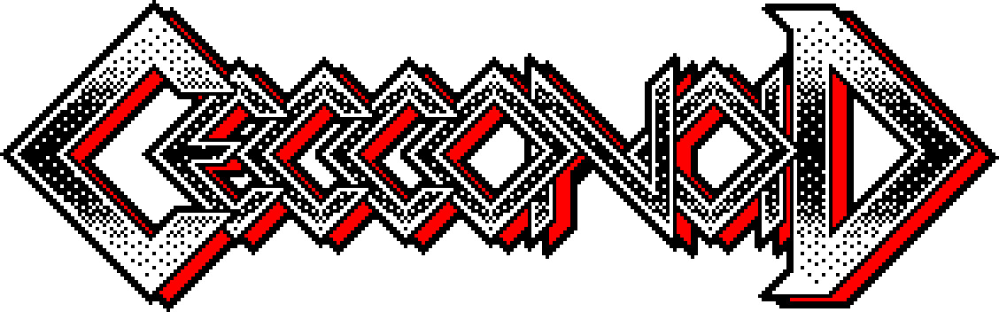

# Cecconoid_CC

This is a snapshot of the DRM free version of Cecconoid (https://triple-eh.itch.io/cecconoid) under a creative commons license. 

## Requirements

Cecconoid requries: 

InControl (https://assetstore.unity.com/packages/tools/input-management/incontrol-14695) and will not run without it due to compiler errors. This is a commercial package that I can't distribute. 

Unity 2019.1.xx -- It should now work under 2019.2.xx but there was a 100% crash in some editor versions when writing to the particle array. 

## License

Cecconoid_CC is distributed under a CC BY 4.0 license (https://creativecommons.org/licenses/by/4.0/). You are free to: 

* Share copy and redistribute the material in any medium or format
* Adapt remix, transform, and build upon the material for any purpose, even commercially. 

As long as you give credit to Gareth Noyce / Triple Eh? Ltd. 

Knock yourselves out. Have fun. 

## Limitations

This repository will NOT be maintained as it is a snapshot of the commercially released branch, which is no longer being updated. Please fork this repository for your own needs. 

I am not able to provide individual support for the contents of this repository. Use at your own risk. May contain nuts. 
